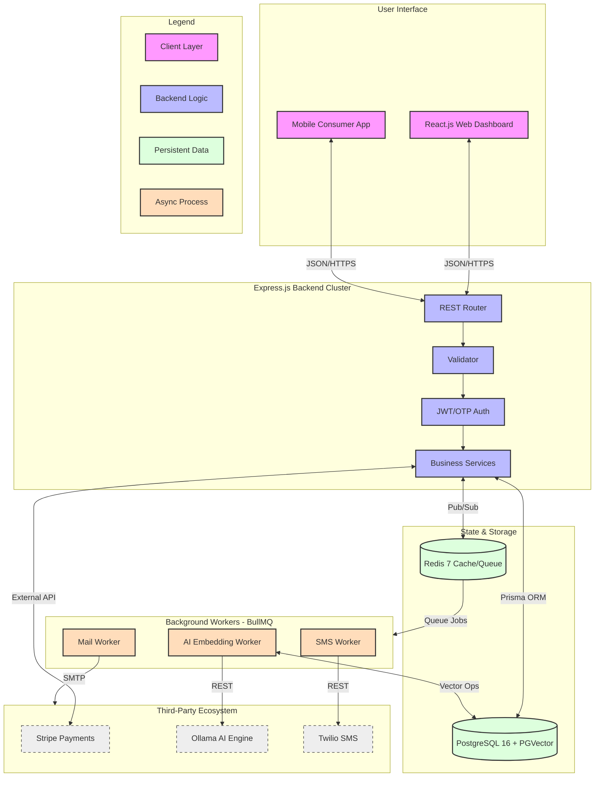

# 🏗️ System Architecture: Fa3liat

Fa3liat is engineered for high-throughput ticketing operations, utilizing a service-oriented monolith architecture with asynchronous processing for non-blocking performance.

## 🗺️ High-Level Topology

The following diagram illustrates the professional distribution of responsibilities across the system layers.

---

## 💎 Architectural Pillars

### 1. Intelligent Search (AI-Powered)
Fa3liat utilizes **Vector Embeddings** to provide semantic search.
- **Technology**: `PGVector` extension for PostgreSQL.
- **Workflow**: Event descriptions are transformed into vectors using the `nomic-embed-text` model via **Ollama**. This allows users to find events based on "vibes" or "intent".

### 2. Transactional Consistency
For seat management, the system employs **Atomic Row Locking**.
- **Mechanism**: Prisma `$transaction` API.
- **Impact**: Ensures that in a multi-tier seat map, once a user initiates checkout, that specific inventory row is locked, preventing overbooking or race conditions.

### 3. Scalable Task Offloading
Heavy operations are never performed on the main thread.
- **Technology**: `BullMQ` (Redis-backed queue).
- **Workers**:
    - **Mail Worker**: Handles system-critical OTP delivery and marketing newsletters.
    - **SMS Worker**: Integrated with Twilio for phone-based verification.
    - **Embedding Worker**: Asynchronously updates the vector database when events are modified.

### 4. Financial Infrastructure
The system implements **Stripe Connect** for complex financial orchestration.
- **Organizer Onboarding**: specialized logic for Hobbyist (ID verification) vs Business/Company (Tax/Doc verification).
- **Payout Logic**: Automated calculation of platform fees vs organizer earnings.

---

## 🔗 Technical Detailed Diagrams

*   🧬 [Database ERD & Schema Logic](./docs/database_erd.md)
*   🔄 [End-to-End Booking Sequence](./docs/sequence_diagram.md)
*   🚥 [Order & Ticket State Lifecycle](./docs/state_diagram_order.md)
*   ⚡ [Real-time Notifications (Socket.io Flow)](./docs/socket_flow.md)
*   🏢 [Organizer Onboarding Flowchart](./docs/flowchart_organizer.md)
*   🤖 [AI Vector Embedding Sequence](./docs/sequence_ai_embedding.md)
*   🛤️ [User Registration Activity Flow](./docs/activity_diagram.md)
*   🧱 [System UML Class Modeling](./docs/uml_class_diagram.md)

---

## 📘 Software Engineering (SWE) Specifications

For a deeper understanding of our internal standards and implementation details, please review the following specifications:

*   🌐 **[API Design Specification](./docs/api_design.md)**: REST principles, JSend format, and status codes.
*   🔒 **[Security Architecture](./docs/security.md)**: AuthN/AuthZ, rate limiting, and data sanitization.
*   🛡️ **[Validation & Error Handling](./docs/validation_error_handling.md)**: express-validator schemas and AppError hierarchy.
*   🧱 **[Service Layer Deep Dive](./docs/services_deep_dive.md)**: Domain logic, transactions, and worker integration.
*   🚢 **[Deployment & Infrastructure](./docs/deployment_guide.md)**: Docker topology, networking, and volumes.
*   📖 **[Glossary & Troubleshooting](./docs/glossary_troubleshooting.md)**: Domain terms and common setup issues.
