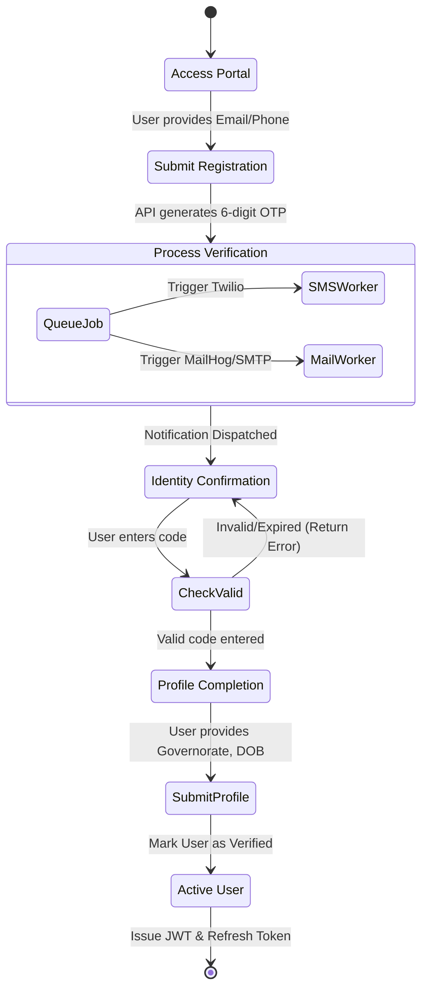

# 🛤️ User Registration & OTP Activity Flow

This diagram visualizes the multi-step verification process for new users, ensuring data integrity and account security.

### ⚙️ Operational Logic
- **Worker Redundancy**: If a user registers with a phone number, the `SMSWorker` is prioritized. If email, the `MailWorker` handles delivery.
- **State Persistence**: The OTP is stored with an `expiresAt` timestamp in PostgreSQL, checked atomically during the `VerifyOTP` call.
- **Graceful Failure**: If background workers are down, the job remains in Redis, ensuring the user eventually receives their code.
