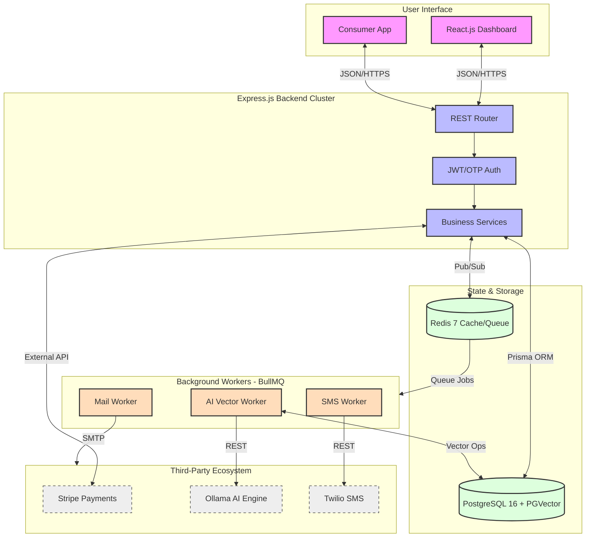

# 🏗️ System Architecture: Fa3liat

This document provides a detailed visual and technical breakdown of the system components and their interactions.

## High-Level Topology

## Layer Descriptions

### 1. Client Layer
- **React Frontend**: A comprehensive dashboard for Organizers and Admins to manage events, payouts, and user reports.
- **Mobile App**: Targeted at attendees for discovering events via AI and presenting QR codes for entry.

### 2. API Layer (Express.js 5.x)
- Uses a **Service-Based Architecture** where controllers only handle request/response, delegating all business logic to decoupled Services.
- **JSend Compliance**: Ensures every API response has a predictable structure (`status`, `data`, `message`).

### 3. Storage Tier
- **PostgreSQL**: Stores relational data and high-dimensional vectors (via `pgvector`).
- **Redis**: Provides sub-millisecond caching and acts as the backbone for task queuing.

### 4. Worker Tier (BullMQ)
- **Email/SMS**: Critical for the "Zero Trust" OTP authentication flow.
- **AI Worker**: Continuously re-vectorizes event data to keep search results fresh and relevant.
