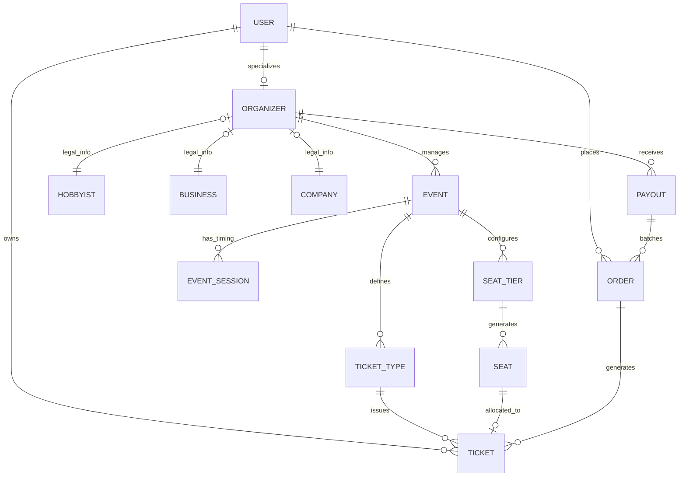

# 🧬 Database Entity Relationship Diagram (ERD)

Fa3liat uses a normalized relational schema designed for transactional integrity and complex event hierarchies.

## ERD Visualization

## Core Schema Logic

### 1. Seating & Inventory
- **Grid Logic**: Venue layouts are stored as tiers (VIP, Standard) with `numberOfRows` and `numberOfColumns`.
- **Atomic Allocation**: The `SEAT` table tracks the `isSold` state. During checkout, we use Prisma's atomic transactions to lock seat rows, ensuring no two tickets are issued for the same physical seat.

### 2. Semantic Data (PGVector)
- The `EVENT` table contains an `embedding` field. This is a vector representation of the event's metadata, enabling sub-second similarity searches using cosine distance.

### 3. Financial Ledger
- **Orders**: Immutable records of purchase attempts.
- **Payouts**: Aggregated ledger entries used to trigger bulk transfers from the platform's Stripe balance to individual Organizer connected accounts.
