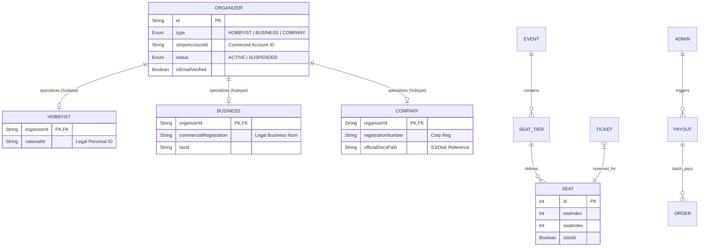

# 🧬 Extended Entity Relationship (EER) Diagram

This diagram visualizes the complex inheritance and specialized relationships within the Fa3liat database, specifically focusing on the Organizer and Seating hierarchies.

### 🧬 Logical Inheritance Details
- **Organizer Sub-typing**: We use a **Class Table Inheritance** pattern where common organizer attributes (contact info, stripe keys) live in the `ORGANIZER` table, while legal verification requirements vary by entity type and live in specialized tables.
- **Seat Mapping**: The system supports complex venues. An `EVENT` can have multiple `SEAT_TIER`s (e.g., VIP, General), each defining a physical grid of `SEAT`s.
- **Batch Payouts**: The `PAYOUT` entity acts as a super-node that aggregates multiple completed `ORDERS` for a single Stripe transfer session.
