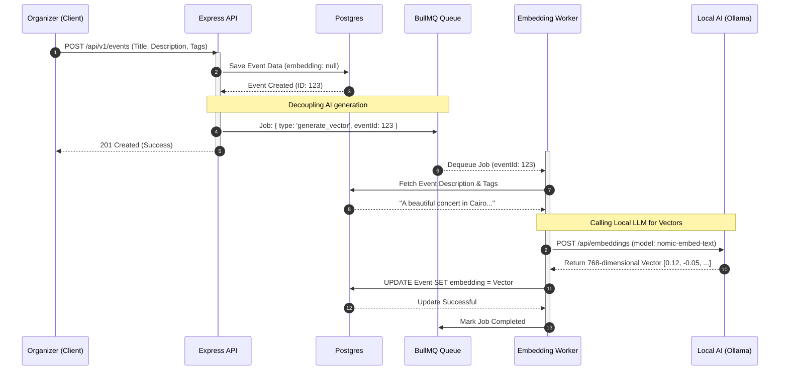

# 🤖 AI Vector Embedding Sequence

This sequence diagram details the asynchronous workflow used to generate AI embeddings for events, ensuring the main API thread remains unblocked and responsive.

### 🧠 Performance Benefits
- **Zero Latency Impact**: The Organizer receives a `201 Created` response instantly. They do not wait for the LLM to process the text.
- **Fault Tolerance**: If the `Ollama` service is temporarily down, the `BullMQ` worker will automatically retry the job with exponential backoff, ensuring no events are missing from the semantic search index.
