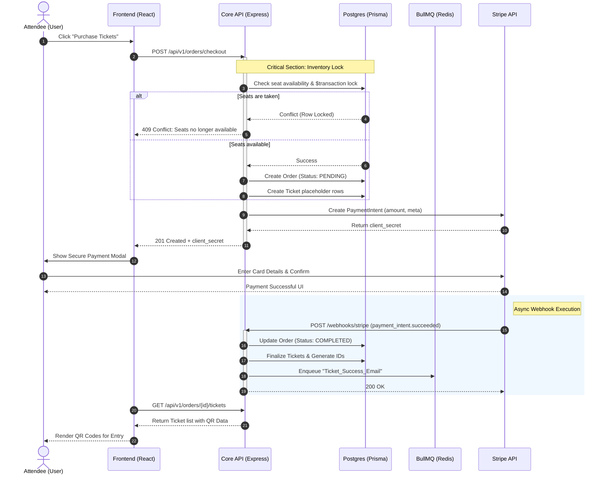

# 🔄 Ticket Booking & Financial Sequence

This sequence diagram details the interaction between system components during a high-stakes transaction, highlighting inventory locking and asynchronous verification.

### 🗝️ Key Architectural Highlights
- **Atomic Transactions**: Steps 4-8 are wrapped in a database transaction to ensure no overbooking occurs.
- **Webhook Decoupling**: The order is finalized only after Stripe confirms the funds, preventing fraudulent ticket generation.
- **Background Delivery**: Ticket confirmation emails are handled by a worker to keep the webhook response sub-second.
