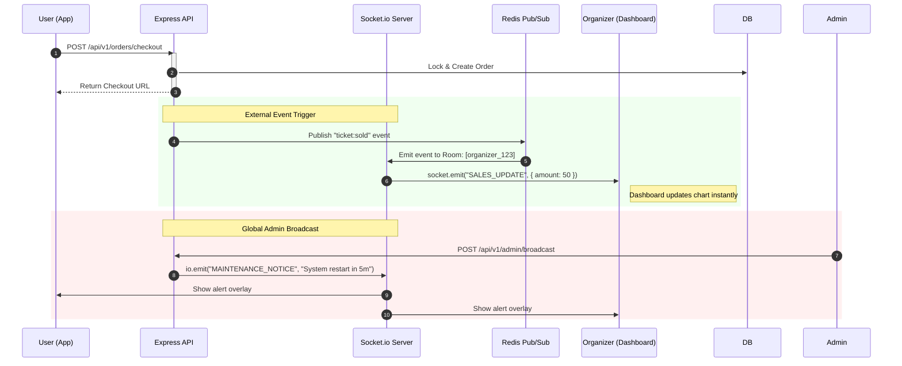

# ⚡ Real-time Interaction Sequence (Socket.io)

This sequence diagram illustrates how Fa3liat uses WebSockets to provide instant feedback to users without page refreshes, specifically for ticket sales and admin broadcasts.

### ⚡ Technical Implementation
- **Rooms**: Users are automatically joined to rooms based on their role and ID (e.g., `user_${id}`, `organizer_${id}`).
- **Redis Adapter**: Even if multiple API instances are running, the `socket.io-redis` adapter ensures messages reach users connected to any server node.
- **Graceful Degradation**: If WebSockets fail to connect, the system falls back to long-polling automatically.
