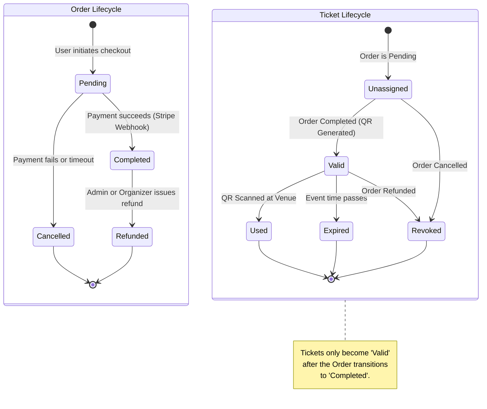

# 🚥 Order & Ticket State Lifecycle

This state diagram visualizes the complex lifecycle of an `Order` and its associated `Ticket`s, illustrating how financial statuses dictate ticket validity.

### 🗝️ State Transitions Logic
- **Pending -> Completed**: Driven entirely by the asynchronous Stripe Webhook. The frontend never dictates payment success.
- **Valid -> Used**: Triggered by the Organizer/Gatekeeper scanning the QR code via the application endpoint.
- **Valid -> Revoked**: If an order is refunded, all associated tickets immediately become invalid, and their QR codes will return an error if scanned.
