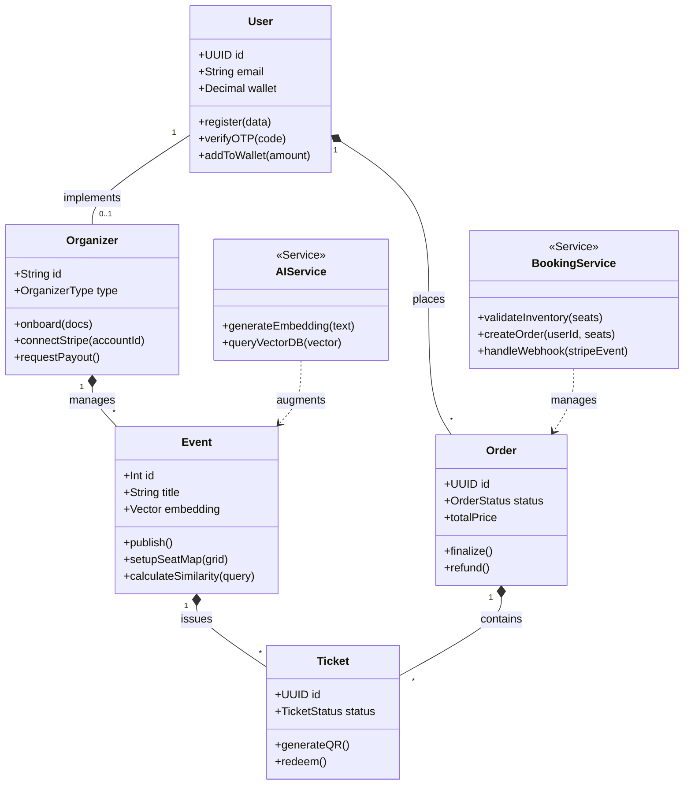

# 🧱 System UML Class Modeling

This diagram models the object-oriented structure of the Fa3liat backend, representing the Core Services and Models that drive the business logic.

### 🧱 Architectural Patterns Used
1.  **Service Layer Pattern**: Core business logic is abstracted from controllers into Services (`BookingService`, `AIService`).
2.  **Repository Pattern (via Prisma)**: Data access is handled by the Prisma client, allowing for type-safe database queries.
3.  **Active Record/Model Logic**: Models like `Ticket` and `Order` handle their own status transitions and side effects (like QR generation).
